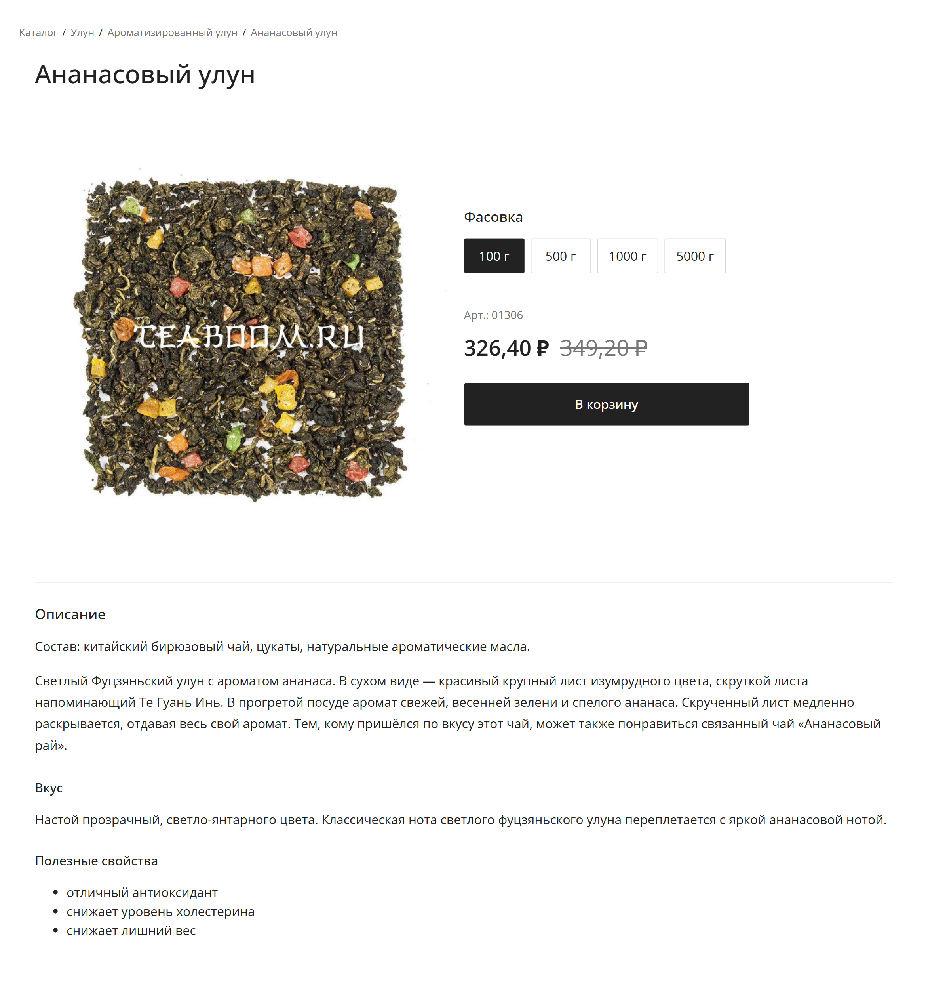

Реализация карточки товара «Ананасовый улун».

## Screenshot


🔗 Live Demo: https://tatiana-golub.github.io/product-page/

## Features

* Адаптивная верстка для desktop, tablet и mobile
* Выбор фасовки товара
* Динамическое изменение цены, старой цены и артикула
* Lightbox для увеличенного изображения товара
* Hover-состояния интерактивных элементов
* Семантическая HTML-разметка

## Technologies

* HTML5
* CSS3
* JavaScript (ES6+)

## Project structure

```text
├── assets/
├── css/
│   ├── base.css
│   ├── components.css
│   ├── layout.css
│   └── responsive.css
├── js/
│   ├── main.js
│   └── lightbox.js
├── index.html
└── README.md
```

## Run locally

Клонируйте репозиторий:

```bash
git clone https://github.com/Tatiana-Golub/product-page.git
```

Перейдите в папку проекта:

```bash
cd product-page
```

Откройте `index.html` в браузере.

Для разработки рекомендуется использовать **Live Server** в VS Code.

